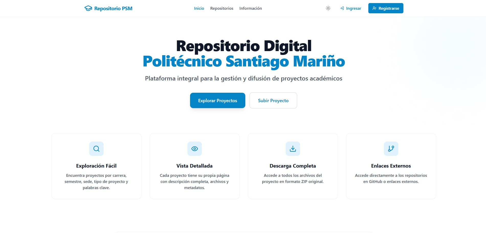
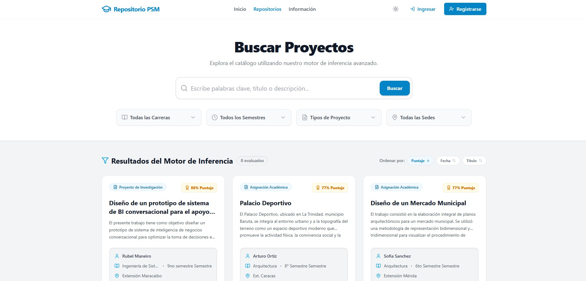
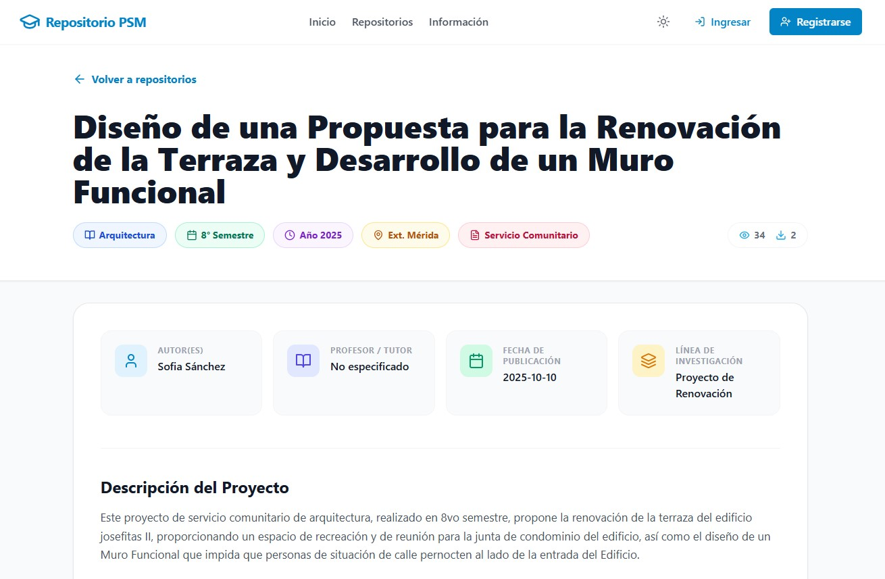
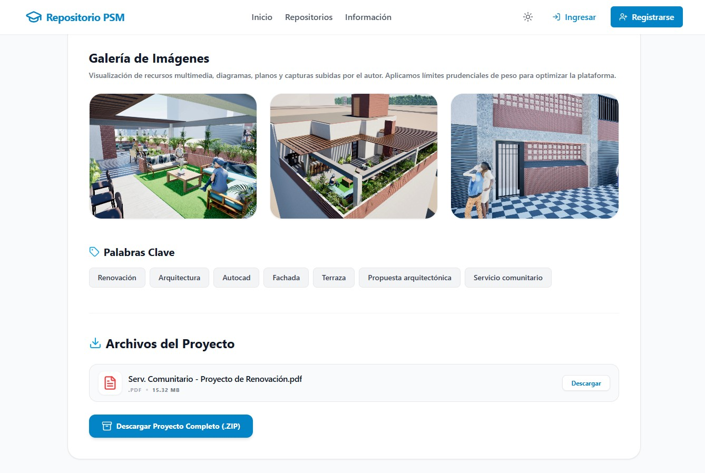

<div align="center" style="margin-bottom: 20px;">
  

  <h1 align="center">🎓 Repositorio Digital PSM 🏢</h1>

  <p align="center">
    <strong>Plataforma inteligente y profesional diseñada para centralizar, preservar y difundir el conocimiento académico generado por la comunidad del <em>Politécnico Santiago Mariño</em>.</strong>
    <br />
    <em>Tesis de Grado - Ingeniería de Sistemas</em>
  </p>

  <p align="center">
    <a href="https://reactjs.org/">
      
    </a>
    <a href="https://vitejs.dev/">
      
    </a>
        <a href="https://tailwindcss.com/">
      
    </a>
    <a href="https://developer.mozilla.org/en-US/docs/Web/JavaScript">
      
    </a>
    <a href="https://supabase.com/">
      
    </a>
    <a href="https://www.postgresql.org/">
      
    </a>
  </p>
</div>

---

## 🚀 Visión General
Este sistema permite a los estudiantes registrar sus proyectos de grado, pasantías y trabajos de investigación en un entorno seguro y estético, facilitando la consulta mutua y elevando el estándar de excelencia universitaria.

## 🛠️ Stack Tecnológico
- **Frontend Core:** React 18 con Vite para un desarrollo ultra-rápido.
- **Estilizado Premium:** Tailwind CSS para una interfaz moderna, responsive y con soporte nativo de Modo Oscuro.
- **Iconografía:** Lucide React para una guía visual clara y minimalista.
- **Backend & Seguridad:** Supabase (PostgreSQL + Go/Rust Auth) para gestión de sesiones y almacenamiento de datos en tiempo real.
- **Routing:** React Router v6 para una navegación fluida entre secciones.

---

## 📐 Sistema Experto: El Índice de Relevancia Académica (IRA)

El núcleo funcional y la innovación principal de esta arquitectura es el **Motor de Inferencia Experto**. Este motor se encarga de calcular matemáticamente el *IRA*, un algoritmo que jerarquiza autónomamente los proyectos basándose en un Modelo de Suma Ponderada (*Weighted Sum Model*).

### La Fórmula Maestra
```math
IRA = (Wt \times T) + (Wp \times P) + (Wv \times V) + (Ws \times S) + (Wk \times K)
```

### Ponderación de Variables
Cada factor del proyecto es normalizado a una escala del 0 a 100 y multiplicado por su peso algorítmico asignado:

- 📊 **( T ) Rigor (30%):** Basado en la jerarquía documental.
- 📈 **( P ) Impacto (25%):** Heurística compensada basada en descargas (con alto peso) y visualizaciones.
- ⏳ **( V ) Recencia (15%):** Penalización estandarizada por años de antigüedad.
- 🎓 **( S ) Afinidad (15%):** Evaluando el nivel de madurez académica según el semestre del responsable.
- 🧠 **( K ) Coincidencia Semántica (15%):** Inteligencia basada en *Fuzzy Matching* sobre diccionarios técnicos especializados propios de cada carrera de ingeniería.

*(Incluye penalizaciones Heurísticas de "Low-Effort" / Anti-Spam para descripciones vacías o poco profesionales)*.

---

## ✨ Características Principales

### 1. Ecosistema de Autenticación Unificado
- Gestión de roles (Estudiante / Administrador).
- Perfiles de usuario reactivos en la barra de navegación.

### 2. Motor de Exploración Inteligente
- Ordenamiento y filtrado avanzado impulsado por el algoritmo **IRA**.
- Búsqueda filtrada por Carrera, Semestre, Sede y Tipo de Proyecto.
- Previsualización dinámica de tarjetas con metadatos y puntaje analítico incrustado.

### 3. Visualización Inmersiva
- Galería multimedia optimizada con sistema Lightbox (estilo Instagram).
- Sección de archivos compacta y enfocada en descargas directas.
- Adaptabilidad total: Centrado ergonómico en móviles y flujo de tarjetas en rejilla para desktop.

### 4. Moderación y Calidad 🛡️
- Panel donde el Administrador valida y audita cada entrega antes de publicarse en la red general.
- Clasificación visual e indicadores de advertencia impulsados por el motor de inferencia.

---

## 📸 Interfaz y Experiencia de Usuario (UI/UX)

<table align="center" width="100%" border="0" style="border: none;">
  <tr>
    <td width="50%" align="center">
      <b>1. Pantalla de Inicio y Dashboard</b><br/>
  
    </td>
    <td width="50%" align="center">
      <b>2. Motor Experto en Acción</b><br/>
      
    </td>
  </tr>
</table>

<table align="center" width="100%" border="0" style="border: none;">
  <tr>
    <td width="50%" align="center">
      <b>3. Ficha Técnica General</b><br/>
      
    </td>
    <td width="50%" align="center">
      <b>4. Anexos y Previsualización Funcional</b><br/>
  
    </td>
  </tr>
</table>


---

## 📋 Cualidades Técnicas
- **Diseño Glassmorphism & Modo Oscuro:** Interfaz optimizada para reducir la fatiga visual.
- **Arquitectura de Contexto:** Manejo ágil de sesiones mediante `AuthContext`.
- **Componentización Sólida:** Creación de utilities puros en JavaScript (`expertSystem.js`) separando lógica pesada de las vistas en React.

<div align="center">
  <br/>
  
  <br/><br/>
  <p>© 2026 - Repositorio Digital PSM. Todos los derechos reservados.</p>
  
</div>
